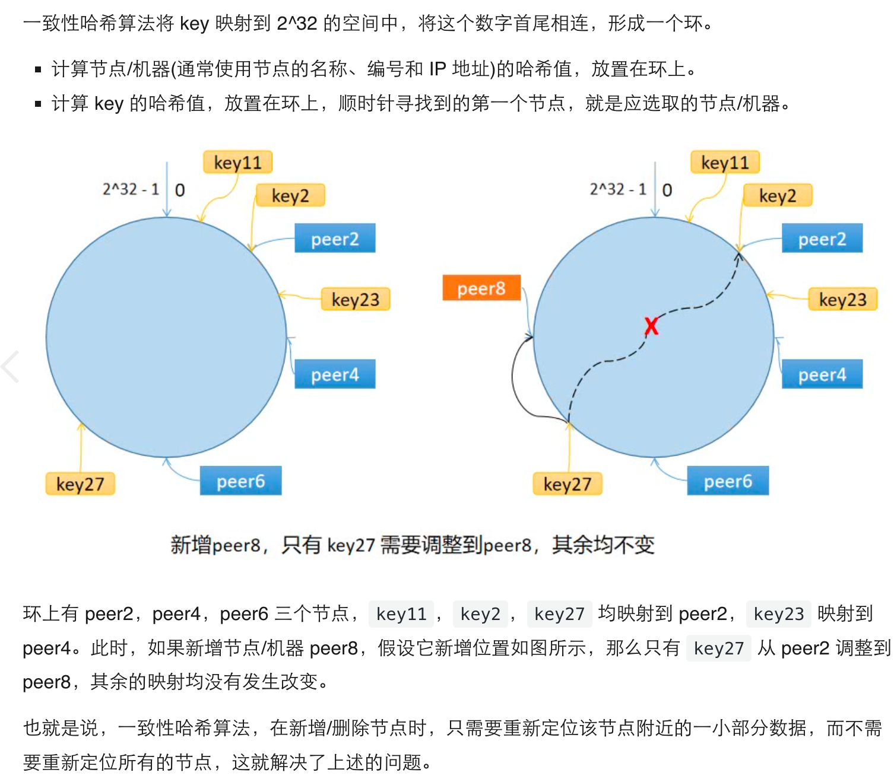
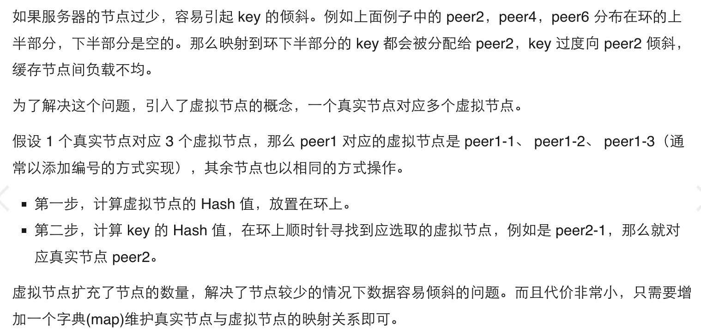

# 一、分布式缓存
存储节点数量发生变化时，普通hash方式，定位到的节点均发生变化，导致所有缓存失效，引发**缓存雪崩**
> 缓存雪崩：缓存在同一时刻全部失效，造成瞬时DB请求量大、压力骤增，引起雪崩。常因为缓存服务器宕机，或缓存设置了相同的过期时间引起。

#### 1.引入一致性hash解决**缓存雪崩**
#### 2.算法原理

#### 2.2数据倾斜问题

### 参考文章
* [极客兔兔](https://geektutu.com/post/geecache-day4.html)